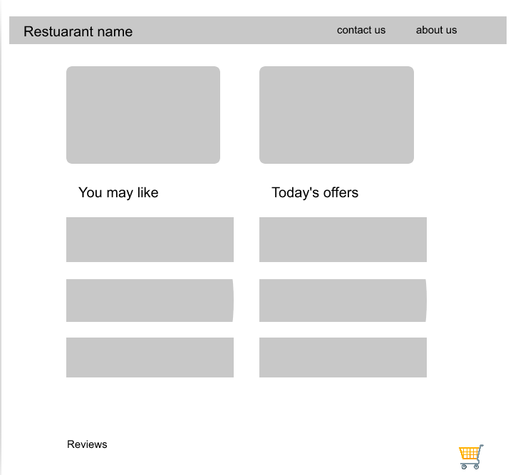
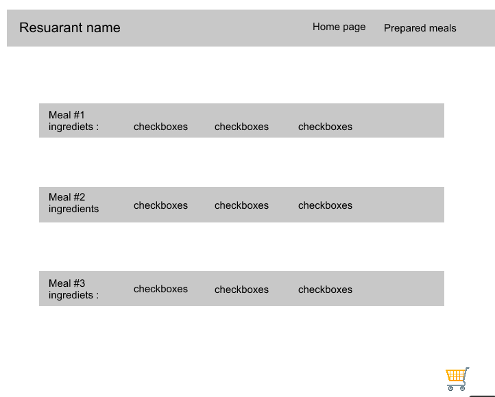
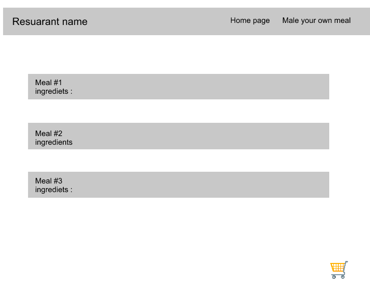
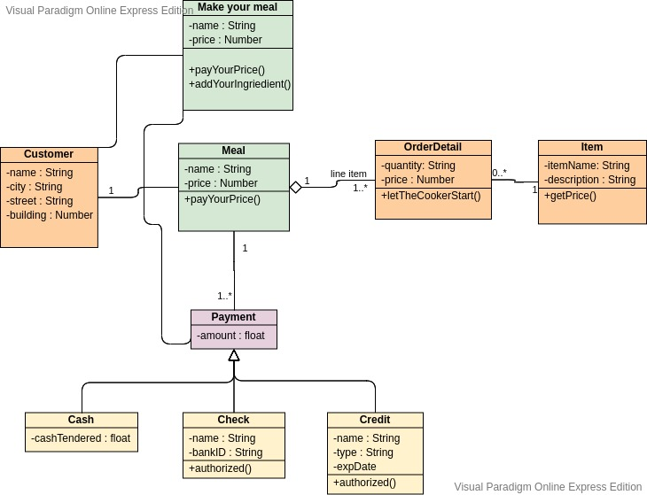

# CodeWeavers Team

# Name of the Project: CodeWeavers Cuisine
# Team members: 
* Boshra Jaber (team leader)
* Bashar Nofal
* Ibrahim Aljabr
* Own Daboubi
* Salah Alawneh
* Yazan Abu Sneneh

# Description of the project: 
Make your own food cousin, a website where you can add your favorite ingredients to make your own favorite meal, cooked by professional cooks and best quality food. And have it delivered to your front door.

# Problem Domain and How the project solves those problems:
* Our site is directed for those who wants to order special meals that are not typically found in a restaurant
* for people who wants to add their own flavors.
* for people who don`t have the time to cook and they are fed up with fast food.
* Our cuisine applies all of the safety and health measures needed for you to have a happy healthy meal 
* with online delivery services.
* The user can travel the world just by visiting us as we provide a lists of most popular dishes from cuisines in all around the world.

# Wire Frame

### Home page

### Make your own meal page

### Prepared meals page

 

# Domain Modeling

# Entity Relationship Diagram for our database:
* Food menu table:
 * 1-to-many relationships
 * First Column: Meal`s name, text.
 * Second Column: Ingredients, text.

# User Stories and Tasks
#### story 1 : 
as a user, i want to display menu of meals we provide so user can see wha we offer:
 1. create a constructor contain following properties and methods : 
     * mealName : string, ingredients array of strings, imgUrl string, Price float.
 2. create favouriteIngredient : method so we can track most picked ingredient
 3. create random number generate random number between 3.0 to 5.0 and update price based on it.
 4. display meals on page.
    create a container that have img + header for meal name + price + ingredients list.
#### story 2 : 
 * As a user, for future i want to add more meals to my menu so customers can try.
  1. Create a form that take from user meal name, checkboxes to add ingredients of new meal,
     Text box to take image url from google.
  2. Add submit button to submit new meal from form.
  3. add event listener to listen to submit button:
      1. it should take user input and add it to consturtor.
      2. redirect user to delivery page.
  4. remove event listener.
#### story 3: 
 as a user i want to make customer create his own meal so they make their preferable ingredients.
  1. create new page and add inside it form.
  2. form contain meal name, ingredients.
  3. add event listen to user submit.
  4. create random number generate random number between 3 to 5 and update price based on it.
  5. add meal to local storage.
  6. redirect user to delivery page.

#### story 4: 
  as I user, i want customer to have flexibilaty in cancel order, or submit feedback or notify when meal delivered.
     1. show a message that tell user order is out for delivery.

#### story 5 : 
   as a user I would like to track customers favourite ingredients so i can use this information to add new meals in futur. And I want data to be presented visually.
   1. create array to track selected ingredient from custom ingredient page.
   2. create counter to track picked ingredients from checklist inside form.
   3. add to local storage.
   4. represent data using chart.js.

#### story 6 :
   as a user, I want customers to feel that they are safe and we are trusted by applying safty and healthy measures by showing our ISO certification.
      1. add ISO certification to home page in footer section.