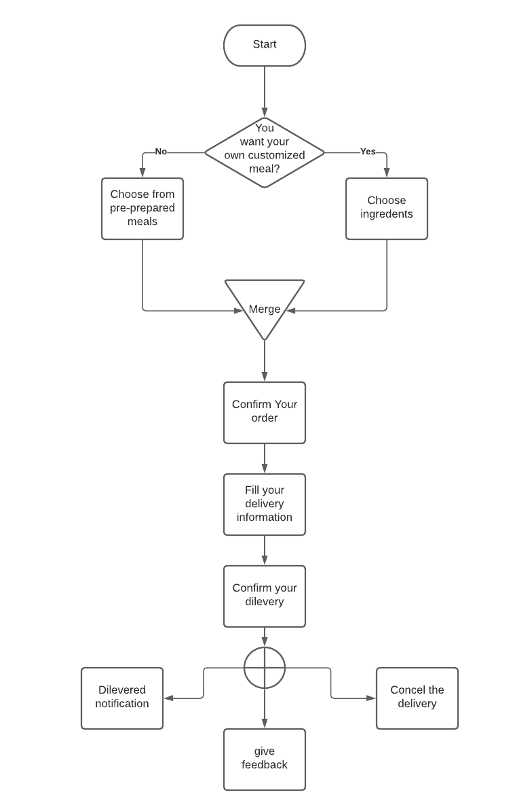

# Software Requirements:
## Vision
> Our vision is to become one of the main cuisines in Jordan, we want to be the go-to place for every tourist and for the locals.
With the fast-growing community, people have less and less time to cook, here is where we come, to provide for you the meals you love, cooked by professionals chefs and with healthy ingredients. Your health and happiness are our number one priority.

## Scope (In/Out)
In:
* Our web will provide lists of dishes from all over the world.
* Our web will provide the user the opportuinty to make his/her own meal cooked by professional chefs.
* Our web will have reviews of our customers and their feedback.
* Our web have a delivery services.
* Our web will be flexable and more ingreidents and meals can be added.
Out:
* Our web provide services inside Amman only.
* Our web provide only halal meals.

## Functional Requirements:
* The user can choose a meal from a menu and make an order.
* The user can choose ingredients to be cooked as he/she likes.
* The user can ask for a dilevery services. 
* The user can can give feedback.

## Data Flow

## MVP: 
We gave the customer the ability to cancel the order which will clear the local storage where the order information are being saved, also give his feedback on the food and the website, both features don't affect the overall functionality of the website.

## Stretch goals: 
* Creating a button to change the color pallet.
* Adding search bar.
* Adding more styles the feedback box.
* Creating "add to favorite my list" button to each prepared meal.

